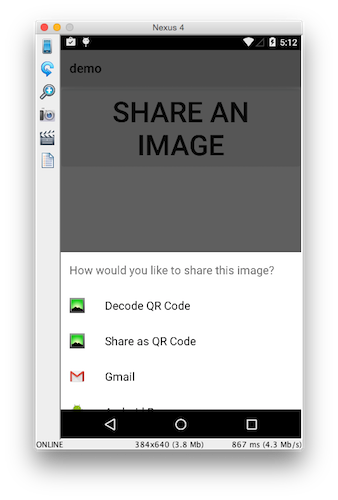

# NativeScript Social Share Plugin

A NativeScript plugin to use the native social sharing widget on Android and iOS. Currently this module supports image and text sharing.




## Installation

Run the following command from the root of your project:

```
$ tns plugin add nativescript-social-share
```

This command automatically installs the necessary files, as well as stores nativescript-social-share as a dependency in your project's `package.json` file.


## Usage

To use the social share module you must first `require()` it. After you `require()` the module you have access to its APIs.

``` js
var socialShare = require("nativescript-social-share");
```

## API

### shareImage(ImageSource image, [optional] String subject)

The `shareImage()` method expects an [`ImageSource`](http://docs.nativescript.org/ApiReference/image-source/ImageSource.html) object. The code below loads an image from the app and invokes the share widget with it:

``` js
var socialShare = require("nativescript-social-share");
var imageSource = require("image-source");

var image = imageSource.fromFile("~/path/to/myImage.jpg");
socialShare.shareImage(image);
```

You can optionally provide a second argument to configure the subject on Android:

``` js
socialShare.shareImage(image, "How would you like to share this image?");
```

### shareText(String text, [optional] String subject)

The `shareText()` method expects a simple string:

``` js
var socialShare = require("nativescript-social-share");
socialShare.shareText("I love NativeScript!");
```

Like `shareImage()`, you can optionally pass `shareText()` a second argument to configure the subject on Android:

``` js
socialShare.shareText("I love NativeScript!", "How would you like to share this text?");
```